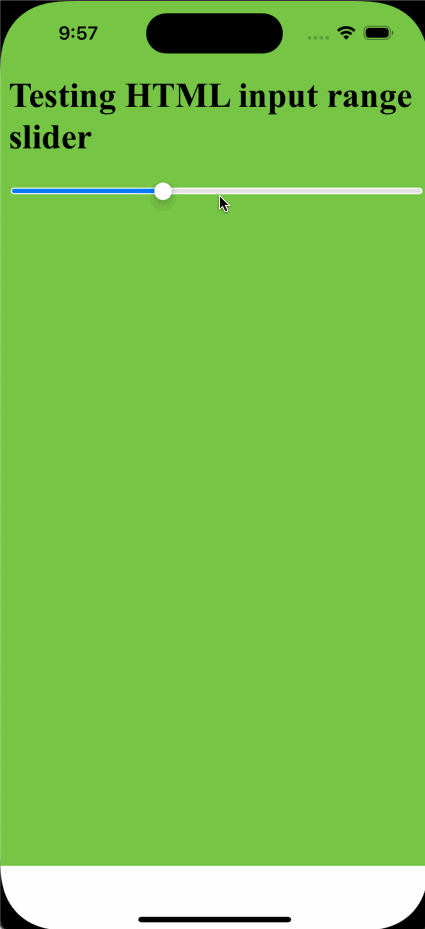

# HTML input range + UIPageViewController demonstration
Tapping and dragging on a slider / input range html element outside the knob area causes paging:

### Notes
* Project created in Xcode 14.3.1 (14E300c)